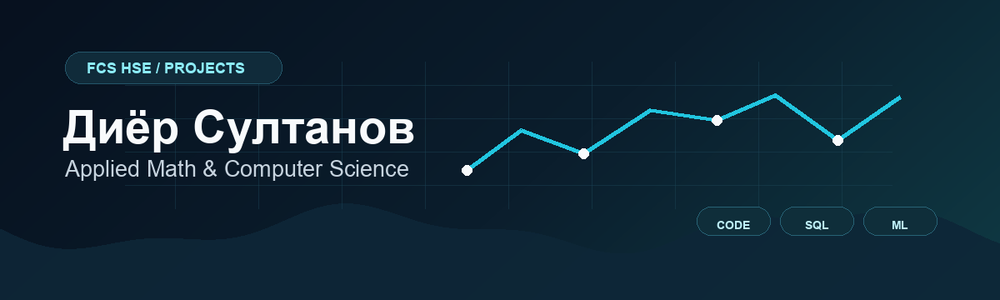

  

  
  

## О себе

Конничива. Я Диёр, учусь на прикладной математике и информатике ФКН ВШЭ. Здесь собираю свои проекты: учебные, курсовые и личные.

Интересуюсь программированием, данными, ML, базами данных и AI-инструментами. Не привязываю профиль к одному направлению: пробую разные задачи и оставляю здесь то, что считаю полезным показать.

## Избранные проекты

| Проект | Что внутри | Стек |
| --- | --- | --- |
| [Анализ качества вина](https://github.com/dior06/wine-quality-analysis) | EDA, статистические тесты, сравнение ML-моделей, ROC-AUC, интерпретация признаков | Python, pandas, scikit-learn, statsmodels |
| [Дашборд Lichess в DataLens](https://github.com/dior06/lichess-datalens-dashboard) | BI-дашборд по 20 058 шахматным партиям, фильтры, рассчитанные поля, проверка преимущества белых | Yandex DataLens, статистика, Kaggle |
| [Бэктестинг ETF-стратегий](https://github.com/dior06/etf-strategy-risk-analysis) | Momentum-сигналы, комиссии, slippage, risk-free rate, walk-forward validation, риск-метрики | Python, yfinance, pandas, sklearn |
| [База данных шахматного клуба](https://github.com/dior06/chess-club-sql) | Реляционная схема, функции, триггеры, аналитические SQL-запросы | PostgreSQL, SQL |
| [Ишкашимский словарь](https://github.com/dior06/ishkashim-dictionary) | Веб-словарь малоресурсного языка, JSON-данные, поиск, фильтры, валидация | JavaScript, HTML/CSS, Python |

## Стек

  
  
  
  
  
  
  
  

## Контакты

- Email: [disultonov@edu.hse.ru](mailto:disultonov@edu.hse.ru)
- GitHub: [github.com/dior06](https://github.com/dior06)
